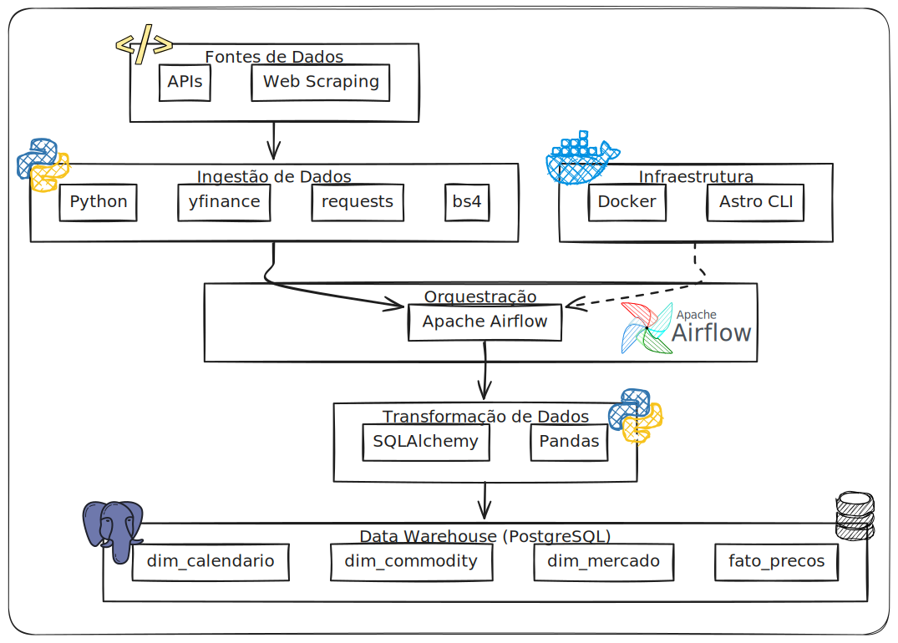
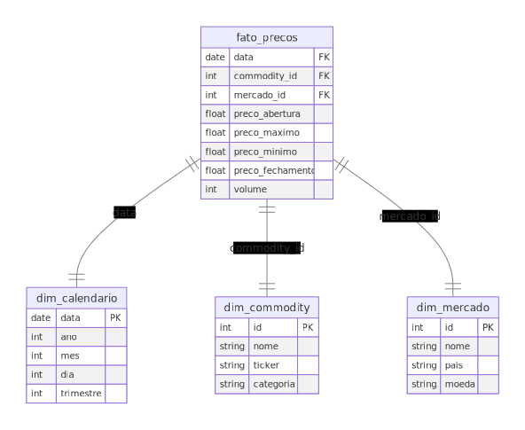

# Projeto MERX - Desafio de Engenheiro de Dados

## Introdução

Este projeto foi desenvolvido como solução para o desafio de seleção da MERX, envolvendo a criação de um pipeline de ingestão, transformação e armazenamento de dados em um Data Warehouse utilizando Apache Airflow, Python, Docker, PostgreSQL, as bibliotecas `yfinance`, `requests`, `bs4`, `sqlalchemy` e `pandas`. Abaixo estão correlacionados os requisitos do desafio e como foram atendidos pela solução proposta.



O Data Warehouse foi modelado em **SQLAlchemy** utilizando o padrão **Star Schema**, com as seguintes tabelas:

- **`dim_calendario`**
- **`dim_commodity`**
- **`dim_mercado`**
- **`fato_precos`**

Abaixo está o diagrama que representa o modelo do Data Warehouse:



## Correlacionando o Projeto com o Desafio

### 1. Ingestão de Dados

- **Web Scraping e Integração com API**: Foi desenvolvida uma DAG no Airflow com duas tarefas principais para a ingestão de dados:
  - **Scraping de Commodities**: Usando o Yahoo Finance, coletamos os tickers de commodities via web scraping.
  - **Integração com API**: Utilizamos a biblioteca `yfinance` para coletar dados históricos de preços de commodities. Ela está especificada em `requirements.txt` no projeto.

- **Parâmetros e Variáveis**: As conexões e variáveis para o PostgreSQL e APIs foram configuradas utilizando o Airflow, facilitando a reutilização e a manutenção do código.

- **Configuração do Banco de Dados**: Foi adicionado um servidor PostgreSQL separado para armazenar o Data Warehouse. Este banco de dados está executando em uma porta distinta, tanto dentro quanto fora do container Docker, garantindo a separação do banco de metadados do Airflow e o banco de dados principal.

### 2. Processamento e Transformação (ETL/ELT)

- **Pipeline de ETL**: Um pipeline de transformação foi criado para realizar a limpeza, normalização e inserção dos dados no Data Warehouse.
- **Validação dos Dados**: Antes de carregar os dados, foi implementada uma etapa de validação para garantir a consistência e qualidade dos dados.

### 3. Personalizações e Execução do Projeto

- **Astro CLI**: Utilizamos o Astro CLI para gerenciar e executar o projeto localmente.  Para instruções de instalação do Astro CLI, consulte [este link](https://www.astronomer.io/docs/astro/cli/install-cli/). Também é necessario ter o Docker instalado.

> **Nota**: Após instalar o Astro CLI, caso o comando `astro` não seja reconhecido pelo terminal, feche o terminal e a IDE, e abra-os novamente para que as alterações no PATH sejam aplicadas corretamente.

O comando para iniciar o ambiente é:

  ```bash
  astro dev start
  ```

> **Nota**: Por padrão, o Airflow no Astro CLI utiliza o PostgreSQL como backend e a Metabase opera na porta `5432`, redirecionando para o host. Caso já exista um serviço PostgreSQL ativo no host, será necessário desligá-lo antes de iniciar o Airflow, para evitar conflitos de porta que podem impedir a inicialização do Airflow.  
> Se você já tentou iniciar o Airflow e encontrou erros relacionados à porta `5432`, desligue o serviço PostgreSQL do host e use o comando `astro dev restart` para reiniciar o ambiente.

- **Servidor PostgreSQL Adicional**: Foi configurado um servidor PostgreSQL adicional, além do banco de metadados do Airflow, para armazenar o Data Warehouse. Este servidor está rodando em uma porta distinta para evitar conflitos.

- **Addin Customizado (@task decorator)**: Implementamos uma personalização no projeto adicionando um "add-on" ao decorator `@task` do Airflow, permitindo o uso do método `empty` que não está disponível por padrão. Isso simplificou a definição de tarefas, deixando o codigo mais limpo.

### 4. Testes

- **Testes Automatizados**: Foi realizada a simulação de um teste automatizado para verificar a execução da DAG. Utilizamos o `pytest` para validar a execução das funções e garantir que o pipeline funcionasse conforme o esperado.

## Documentação e Governança

- [Requisitos do Desafio](docs/requisitos_desafio.md): Detalhes sobre os requisitos do desafio de seleção da MERX.
- [Governança de Dados](docs/governanca_dados.md): Detalhes sobre as práticas de governança de dados implementadas no projeto, incluindo controle de qualidade, auditoria e segurança.
- [Execução do Projeto](docs/execucao_projeto.md): Instruções detalhadas sobre como executar o projeto e configurar o ambiente.
